# Procesverslag

## Ontwerper:
Timo Smit

### Je startniveau:
Mijn startniveau is: Rood

# Je plan

  
Ik heb gekozen om de Eeveelutions uit te werken in een website. Hierbij wil ik door middel van HTML, CSS en JavaScript een leuke manier bedenken om duidelijk te maken wat de evoluties zijn van Eevee. 

  ### De eerste versie/schets:
  

  ### Je ambitie: 
  Aan deze technieken/punten wil ik werken:
  - Ik wil mijn kennis van HTML en CSS opfrissen en efficiënter te werken.
  - Blauwe piste helpen met coderen.
  - JavaScript heb ik wel eens gebruikt voor eerdere lessen, echter ken ik hier erg weinig van dus wil ik hier meer van leren en het ook toepassen in mijn website.
 

## Voortgang/Feedback 1

  
Mijn bevindingen + wijzigingen

  ### Bevinding 1:
  JavaScript ben ik niet machtig, ik weinig in JS gedaan hiervoor maar ik wil wel veel uitproberen aangezien ik denk dat het de website goed zal doen en omdat het mij leuk lijkt om te leren.

  #### oplossing:
  Door video's te kijken en door op te zoeken wat toepasselijk is voor de huidige situatie leren hoe je bepaalde dingen kan oplossen.

  ### Bevinding 2:
  Orginaliteit aangezien meer mensen hetzelfde onderwerp hebben.

  #### oplossing:
  Ik heb een DS gemaakt met de uitleg van het maken van de GameBoy. Hierdoor kan ik meer nieuwere achtergronden gebruiken aangezien het op een DS is. Ik heb toch voor de oudere knoppen gekozen voor een contrast en een speelsere look aangezien de typografie in de nieuwe games vrij saai is. 

  ### Bevinding 3:
  Animeren in CSS was nieuw voor mij. Ik had nooit met keynotes gewerkt, enkel met transform:translate om items te verplaatsen.

  #### oplossing:
  Door de les te volgen en zelf dingen uit te proberen heb ik de basics geleerd en het proberen toe te passen in de website.

  
  
  ### Bevinding 4:
  Als tip van Rowin ::before en ::after te gebruiken. Dit heb ik ook nooit eerder gebruikt.

  #### oplossing:
  Door te proberen in combinatie met wat feedback is het gelukt door te krijgen hoe het werkt en het toe te passen.
  
  
  
  ### Bevinding 5:
  Feedback Isabelle - Veel aandacht geven aan de transities, vooral bij het evolueren. De DS is een leuk idee en zorg dat alles goed zichtbaar blijft in het kleine scherm.

  #### oplossing:
  Onderzoek doen hoe pokemons evolueren in de game en dit zo goed mogelijk toepassen met CSS en JS.

## Voortgang/Feedback 2

  
Mijn bevindingen + wijzigingen

  
  ### Bevinding 1:
  Feedback Isabelle - Veel aandacht geven aan de transities, vooral bij het evolueren. De DS is een leuk idee en zorg dat alles goed zichtbaar blijft in het kleine scherm.

  #### oplossing:
  Onderzoek doen hoe pokemons evolueren in de game en dit zo goed mogelijk toepassen met CSS en JS.

  ### Bevinding 2:
  Geen gebruik van p's in mijn website.

  #### oplossing:
  De H1 nam te veel ruimte op bij sommige pagina's dus heb ik de H1 korter gemaakt en een informatie-knop toegevoegd waar door middel van p's is uitgelegd wat er gebeurd.
  
  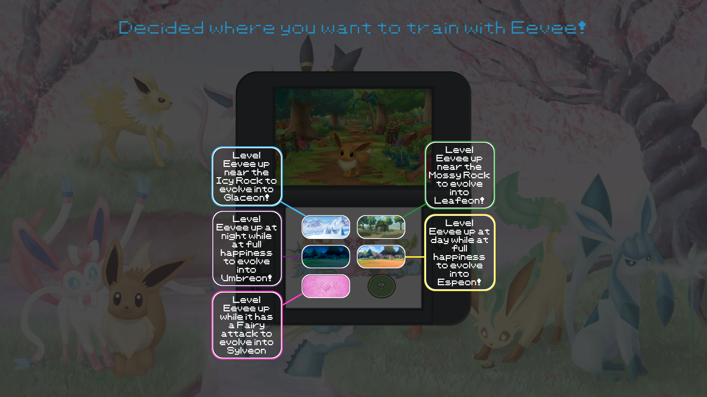

  

  ### Bevinding 3:
  Meer gebruik maken van witruimte om makkelijker later terug te kunnen vinden.

  #### oplossing:
  Bij de tussenkopjes die ik al had extra aandacht gevraagd door de koppen te onsingelen met sterretjes en om het geheel heen witruimte toegevoegd.
  
  
  
  ### Bevinding 4:
  Custom properties toevoegen.

  #### oplossing:
  Ik heb uiteindelijk gekozen niet gebruik te maken van custom properties aangezien ik niet veel kleuren vaak hergebruik en alles al een kleur had gegeven voordat ik af wist van custom properties. Echter weet ik voor volgende keer zeker dat ik het wel ga gebruiken aangezien het erg handig is.
  
  
  
    ### Bevinding 5:
  Feedback Amber: display:none komt heel vaak voor.

  #### oplossing:
  Ik heb in verband met mijn matige kennis van JS elke img apart een class gegeven ze zo los op te roepen en gemakkelijk kon toepassen wat ik wilde.
  

## Voortgang/Feedback 3

  
Mijn bevindingen + wijzigingen (minimaal 5)

  
  ### Bevinding 1:
  Feedback Sanne: opacity: 0 gebruiken in plaats van display: none aangezien je het kan animeren.

  #### oplossing:
  Aangezien het hetzelfde doet en het erg veel veranderen is ga ik het zeker onthouden voor volgende keer, echter hebben andere punten nu voorrlang.

  ### Bevinding 2:
  Opletten op contrast op de pagina.

  #### oplossing:
  Bij de p's heb ik gekozen voor wit op zwart voor een goed contrast en bij de H1 heb ik gekozen voor blauw op wit wat volgens de contrastmeter veel beter uit kwam dan de groen die ik eerst had.

  

  ### Bevinding 3:
  Aanpassingen maken zodat de website ook goed werkende is op Github.
  
  #### oplossing:
  URL's aangepast naar ../ waar nodig in de CSS en JS.
  
  
  
  
    ### Bevinding 4:
  -
  
  #### oplossing:
  -
  
  
  
  
    ### Bevinding 5:
  -
  
  #### oplossing:
  -
  
  
  
  
  

## Reflectie

  
Mijn eindresultaat & persoonlijke ontwikkeling

  ### Je uitkomst - karakteristiek screenshot(s):
   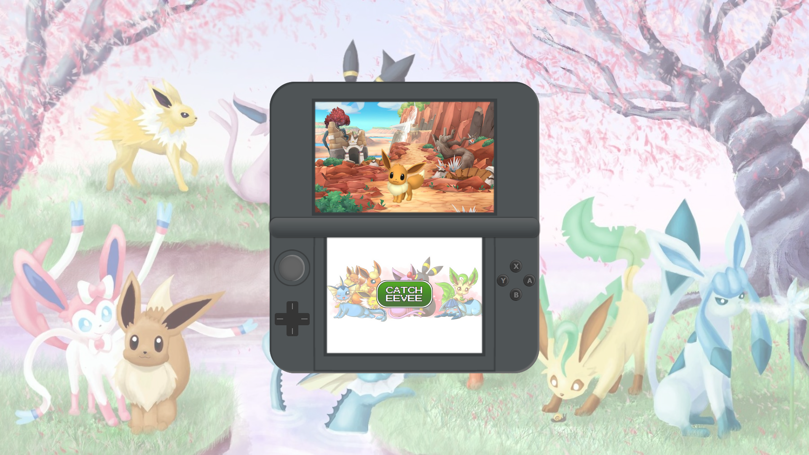
   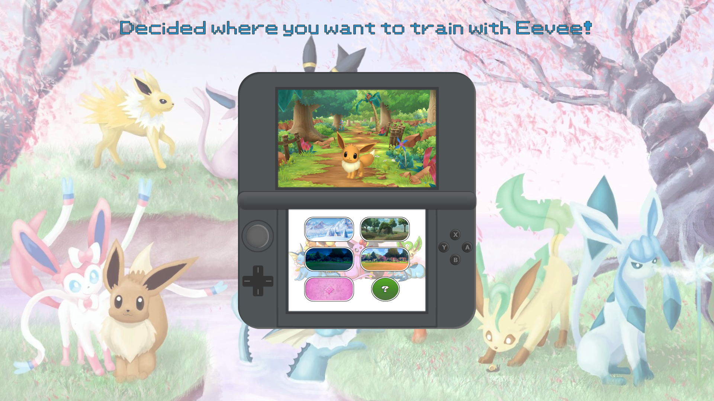
   
   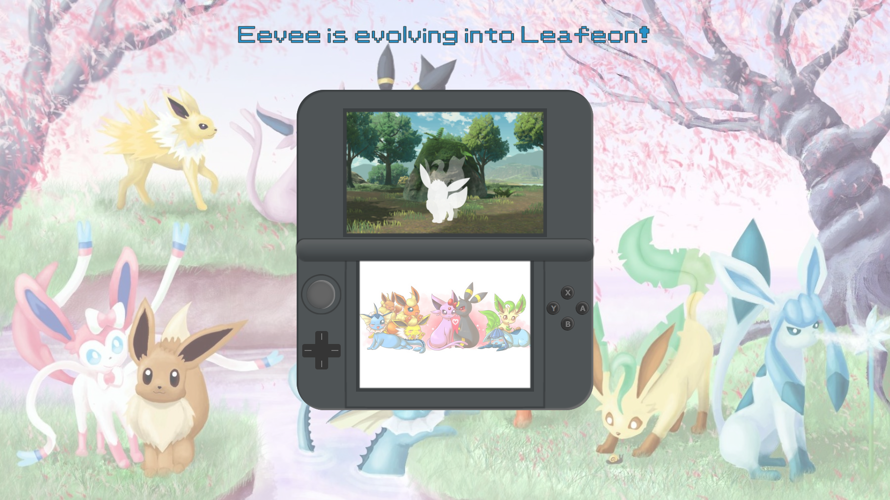
   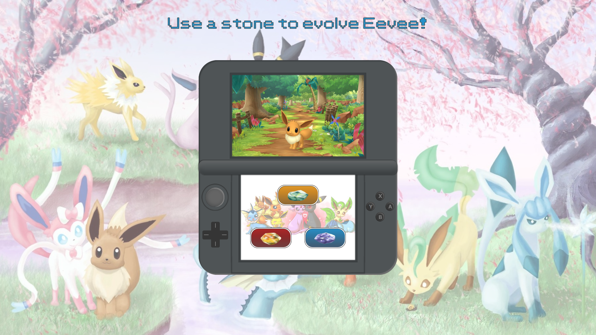
   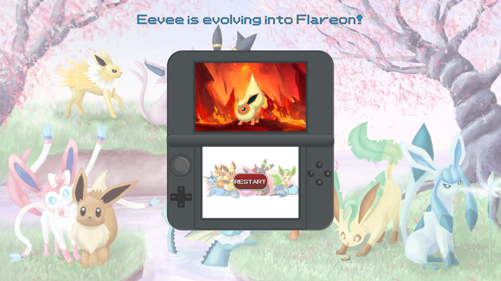

  ### Dit ging goed/Heb ik geleerd: 
  Nieuw geleerd: ::after, ::before, box-shadow, :not, var loop & classList.add
  
   
   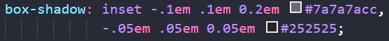
   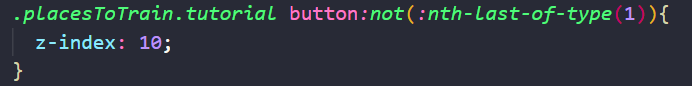
   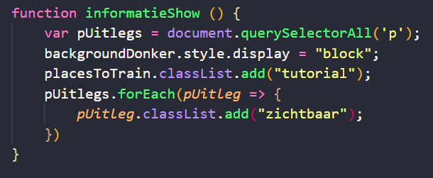
   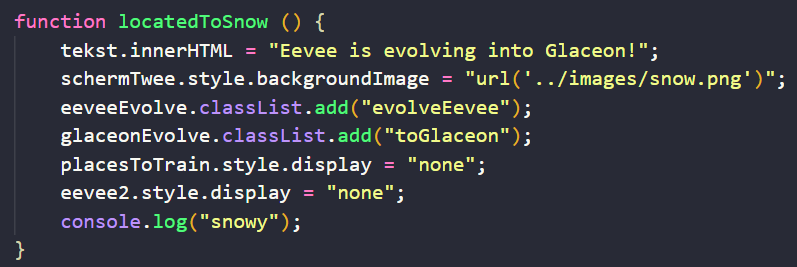

  ### Dit was lastig/Is niet gelukt:
  Mooi maken van code (niet display: none x10), iets te weinig responsive naar mijn mening & on hover laat p zien
  
  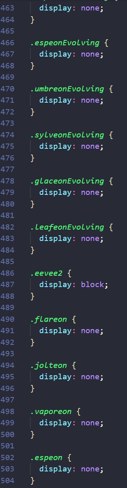
  
  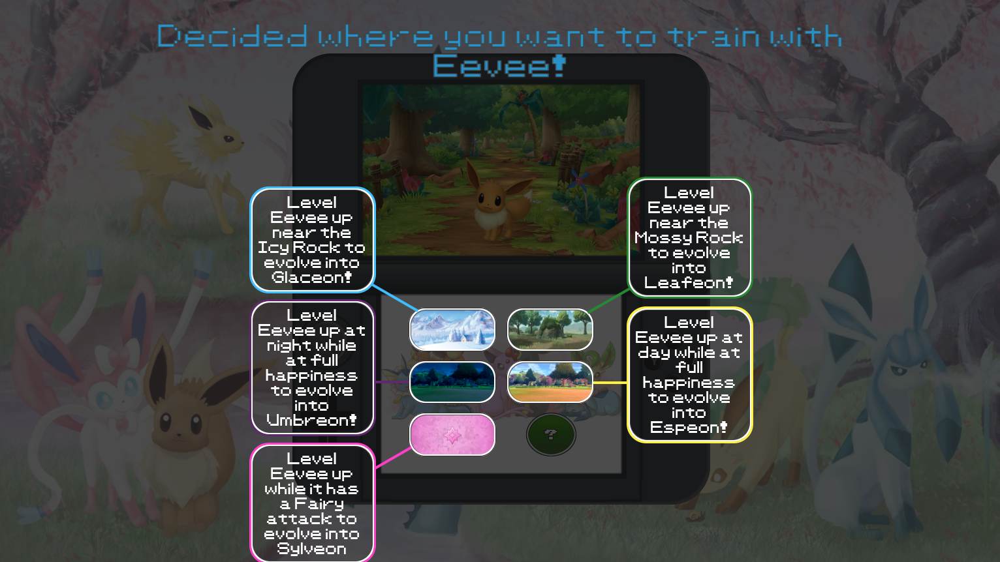

## Bronnenlijst

continu bijhouden terwijl je werkt

Nb. Wees specifiek ('css-tricks' als bron is bijv. niet specifiek genoeg).

1. https://cssgradient.io/
2. Rowin
3. https://developer.mozilla.org/en-US/docs/Web/HTML/Global_attributes/tabindex?retiredLocale=nl
4. https://stackoverflow.com/questions/9529327/change-the-value-of-h1-element-within-a-form-with-javascript

