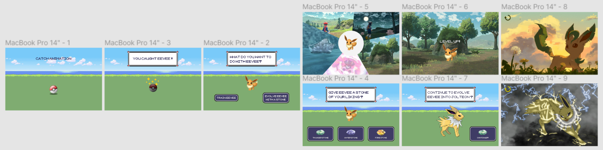

# Procesverslag

## Ontwerper:
Timo Smit

### Je startniveau:
Mijn startniveau is: Rood

# Je plan

  
Ik heb gekozen om de Eeveelutions uit te werken in een website. Hierbij wil ik door middel van HTML, CSS en JavaScript een leuke manier bedenken om duidelijk te maken wat de evoluties zijn van Eevee. 

  ### De eerste versie/schets:
  

  ### Je ambitie: 
  Aan deze technieken/punten wil ik werken:
  - Ik wil mijn kennis van HTML en CSS opfrissen en meer leren efficiënter te werk te gaan.
  - JavaScript heb ik wel eens gebruikt voor eerdere lessen, echter ken ik hier erg weinig van dus wil ik hier meer van leren en het ook toepassen in mijn website.
 

## Voortgang/Feedback 1

  
Mijn bevindingen + wijzigingen

  ### Bevinding 1:
  JavaScript ben ik niet machtig, ik weinig in JS gedaan hiervoor maar ik wil wel veel uitproberen aangezien ik denk dat het de website goed zal doen en omdat het mij leuk lijkt om te leren.

  #### oplossing:
  Door video's te kijken en door op te zoeken wat toepasselijk is voor de huidige situatie leren hoe je bepaalde dingen kan oplossen.

  ### Bevinding 2:
  Orginaliteit aangezien meer mensen hetzelfde onderwerp hebben.

  #### oplossing:
  Ik heb een DS gemaakt met de uitleg van het maken van de GameBoy. Hierdoor kan ik meer nieuwere achtergronden gebruiken aangezien het op een DS is. Ik heb toch voor de oudere knoppen gekozen voor een contrast en een speelsere look aangezien de typografie in de nieuwe games vrij saai is. 

  ### Bevinding 3:
  -

  #### oplossing:
  -

## Voortgang/Feedback 2

  
Mijn bevindingen + wijzigingen

  
  ### Bevinding 1:
  Feedback Isabelle - Veel aandacht geven aan de transities, vooral bij het evolueren. De DS is een leuk idee en zorg dat alles goed zichtbaar blijft in het kleine scherm.

  #### oplossing:
  Onderzoek doen hoe pokemons evolueren in de game en dit zo goed mogelijk toepassen met CSS en JS.

  ### Bevinding 2:
  Omschrijving van wat er nog niet orde was (tekst en afbeeding(en)).

  #### oplossing:
  Beschrijving hoe je het hebt hebt opgelost of als het niet gelukt is hoe je het zou oplossen (tekst en afbeeding(en)).

  ### Bevinding 3:
  ...

## Voortgang/Feedback 3

  
Mijn bevindingen + wijzigingen (minimaal 5)

  
  ### Bevinding 1:
  Omschrijving van wat er nog niet orde was (tekst en afbeeding(en)).

  #### oplossing:
  Beschrijving hoe je het hebt hebt opgelost of als het niet gelukt is hoe je het zou oplossen (tekst en afbeeding(en)).

  ### Bevinding 2:
  Omschrijving van wat er nog niet orde was (tekst en afbeeding(en)).

  #### oplossing:
  Beschrijving hoe je het hebt hebt opgelost of als het niet gelukt is hoe je het zou oplossen (tekst en afbeeding(en)).

  ### Bevinding 3:
  ...

## Reflectie

  
Mijn eindresultaat & persoonlijke ontwikkeling

  ### Je uitkomst - karakteristiek screenshot(s):
  

  ### Dit ging goed/Heb ik geleerd: 
  Korte omschrijving met plaatje(s)

  

  ### Dit was lastig/Is niet gelukt:
  Korte omschrijving met plaatje(s)

  

## Bronnenlijst

continu bijhouden terwijl je werkt

Nb. Wees specifiek ('css-tricks' als bron is bijv. niet specifiek genoeg).

1. bron 1
2. bron 2
3. ...

